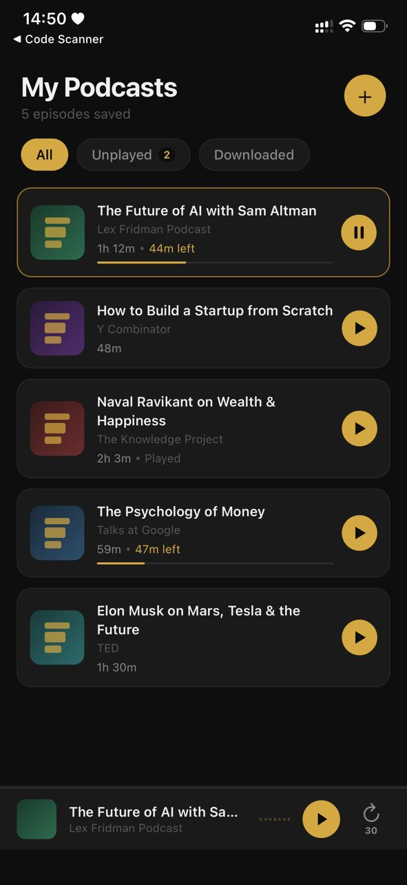
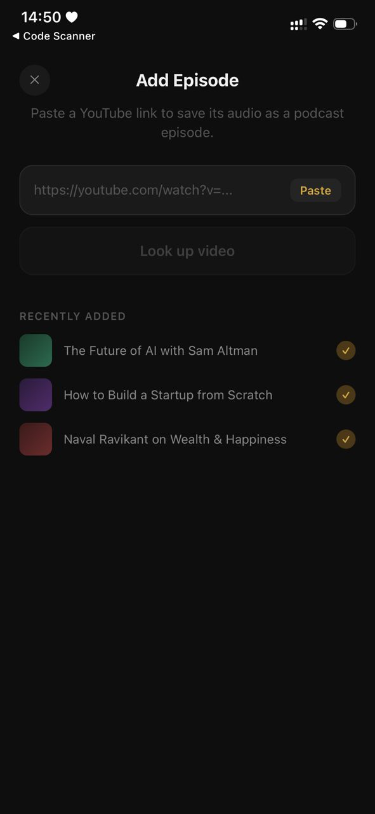
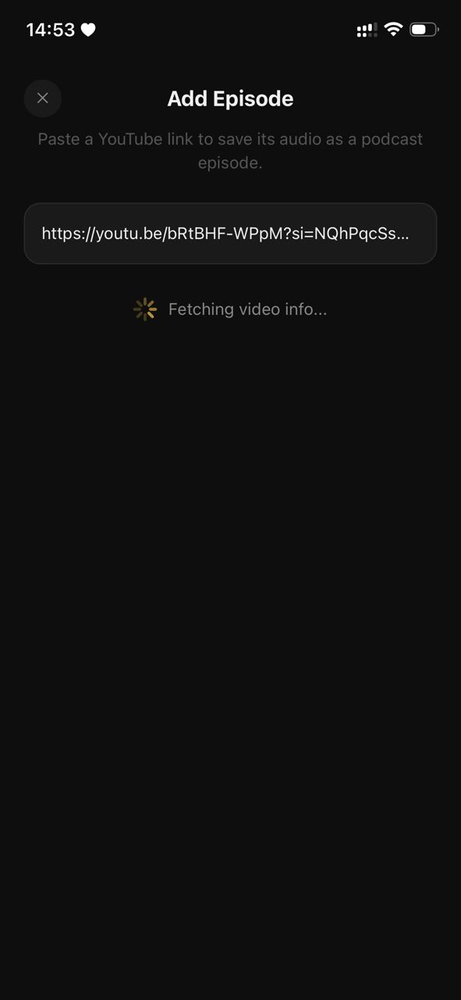
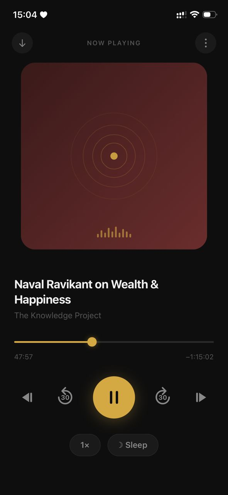
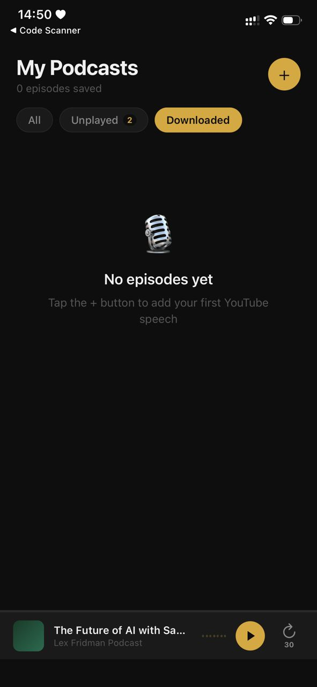

# Podify
**Turning fleeting YouTube moments into your personal mindset library.**

## The Problem
We’ve all been there: You’re deep into a listening day, and a YouTube video hits differently. Maybe it’s a Kobe Bryant storytelling masterpiece or a deep-dive philosophy lecture. For ten minutes, your mindset is shifted; you’re ready to take on the world.
Then the video ends. You lock your phone, the audio cuts out (thanks, non-Premium), and you’re back to reality. The inspiration fades because it’s trapped inside a video player. 


## The Solution
Podify was built to bridge the gap between watching and internalizing. It’s a React Native mobile experience designed to transform any impactful YouTube link into your own private podcast feed.

* **Paste & Convert:** Drop a link, get a podcast.
* **The "Lock-In" Factor:** Designed for those moments when you need to zone out the world and focus on the narrative.
* **Offline Zen:** Listen anytime, anywhere—no data, no distractions, just the content.


#### Installation
1.  **Clone the repo:**
    ```bash
    git clone https://github.com/mayanjabbaale/podify.git
    ```
2.  **Install dependencies:**
    ```bash
    npm install
    ```
3.  **Fire it up:**
    ```bash
    npx expo start
    ```

---

### Sights of Podify

<!--  -->

<p align="center">
  <strong>Home & Conversion Flow</strong><br><br>
  
  
  
</p>

<p align="center">
  <strong>Lock-In Player & Offline Library</strong><br><br>
  
  
</p>